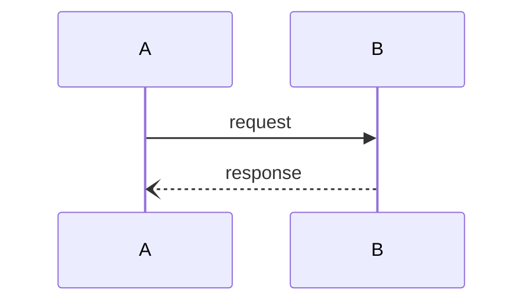
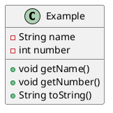

# Diagrammer

## Sobre o Projeto

O **Diagrammer** é um projeto desenvolvido no contexto da disciplina de **Projeto e Estágio** do **Instituto Superior de Engenharia de Coimbra (ISEC)**.  
Este projeto tem como objetivo a criação de uma aplicação web e de componentes em **ReactJS**, permitindo a construção rápida de diagramas.  

A interface do **Diagrammer** possibilita ao utilizador definir diagramas de forma **declarativa**, garantindo flexibilidade e eficiência no processo de modelagem.

## Tecnologias Utilizadas

- **React**  
- **TypeScript**  
- **bpmn-js** (para modelagem e manipulação de diagramas BPMN)  

## Funcionalidades

- Construção de diagramas de forma intuitiva  
- Suporte a modelagem declarativa  
- Personalização e manipulação de elementos  
- Integração com **bpmn-js** para a modelagem BPMN  

Desenvolvido por Diego Lima 
Orientado por João Costa
ISEC - Instituto Superior de Engenharia de Coimbra 
